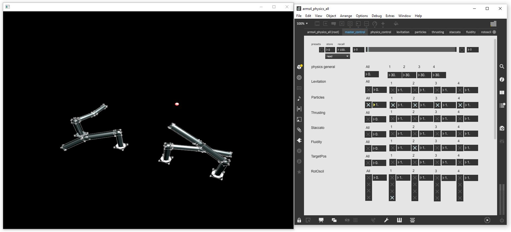

# AI-Toolbox - Motion Simulation - Articulated Bodies



Figure 1: Screenshot of the Articulated Bodies tool. The window on the left shows the visual output of the Articulated Bodies tool. In the example provided here, there are four bodies that are displayed in the visual output as well as a single target position that can be controlled by a dancer. The bodies are shown as solid blue shapes together with bounding boxes of each body segment drawn as a white wireframe.  The window on the right shows an example Max patch that illustrates how to control the Articulated Bodies tool by sending it OSC messages.

### Summary

This tool is a C++-based software that employs the rigid body dynamics functionality of the [Bullet physics engine](https://github.com/bulletphysics/bullet3) to simulate the behaviour of articulated  bodies that can possess arbitrary morphologies. This physics simulation has been extended with several functions (called behaviours from here on) that manipulate the rotations of body joints or apply external forces to the bodies in order to make the bodies movie in a manner that evokes several idiosyncratic movement qualities of choreographer Muriel Romero. The example provided here employs for identical arm-like bodies, each equipped with 6 revolute joints. These configuring the properties of the bodies and their behaviours appropriately (see figure 3), the arms can be made to move with one of the following movement qualities: Levitation, Particles, Fluidity, Staccato, Thrusting. In addition to exhibiting specific movement qualities, the arms can also be made to towards an arbitrary position in space. This position could correspond to the position of a dancer on stage. While running, the tool sends motion data in the form of absolute positions, absolute rotations, and relative rotations of body joints via [OSC](https://en.wikipedia.org/wiki/Open_Sound_Control) to a destination address. The tool can also be remote controlled via [OSC](https://en.wikipedia.org/wiki/Open_Sound_Control).

### Installation

To simply run the tool, no installation is required. The software runs on any MacOS or Windows 10 or 11 operating system. If the user wants to compile the software from source, both a C++ IDE such as [XCode](https://developer.apple.com/xcode/) on MacOS or [Visual Studio](https://visualstudio.microsoft.com/vs/community/) on Windows and the [openFrameworks](https://openframeworks.cc/) creative coding environment need to be installed beforehand. Installation instructions for Visual Studio and openFrameworks are available in the [AI Toolbox github repository](https://github.com/bisnad/AIToolbox). 

The software can be downloaded by cloning the [MotionSimulation Github repository](https://github.com/bisnad/MotionSimulation). After cloning, the software is located in the MotionSimulation / ArticulatedBodies directory.

### Directory Structure

ArticulatedBodies

- bin (contains the software  executable and dynamic libraries)
  - data
    - 3d_models (contains 3d models of body parts and body descriptions for the articulated bodies)
    - shaders (contains GLSL shader code to render the flocking agents)
- controls (contains several example Max patches for controlling the tool by sending OSC messages)
- data 
  - media (contains media used in this Readme)
- src (contains the source code files)

### Usage

#### Start

The tool can be started by double clicking the executable ArticulatedBodies file. During startup, the tool loads a URDF file and instantiates a number of articulated bodies from it that are placed in specific locations in simulation space. By default, the tool loads the URDF file for a simple arm-like body that possesses 6 revolute joints. To change the URDF file that is loaded, the following source code in the file ofApp.cpp has to be modified:

```
urdfImporter.loadURDF(ofToDataPath("3d_models/base_links_v3_v2/robot.urdf")); 
```

The string value that is passed as only parameter to the `loadURDF` function represents the path to the URDF file. Several example UDRF files are provided in the `ArticulatedBodies / data / 3d_models` folder. 

After loading, the example creates by default 4 identical articulated bodies and places them along a line. The base of the bodies is fixed. For this reason, the bodies will not move away from this initial location. To change the number of bodies and their positioning, the following source code in the file ofApp.cpp has to be modified:

	std::shared_ptr<dab::physics::BodyPart> base;
	
	glm::vec3 bodyMinPos(-1.5, 0.0, 0.0);
	glm::vec3 bodyMaxPos(1.5, 0.0, 0.0);
	glm::quat bodyRot(glm::vec3(PI / 2.0, 0.0, 0.0));
	int bodyCount = 4;
	
	for (int bI = 0; bI < bodyCount; ++bI)
	{
	    glm::vec3 bodyPos = bodyMinPos + (bodyMaxPos - bodyMinPos) * float(bI) / float(bodyCount - 1);
	
	    std::string bodyName = "onshape";
	
	    if (bI > 0)
	    {
	        bodyName += std::to_string(bI + 1);
	        physics.copyBody("onshape", bodyName);
	    }
	
	    base = physics.part(bodyName, "base");
	    base->setPosition(bodyPos);
	    base->setRotation(bodyRot);
	}

**Custom Articulated Bodies**

It is possible to create your own articulated bodies and export them as URDF files. The simplest way to design such morphologies is by using a solid modelling CAD program such as [OnShape](https://www.onshape.com/en/) . As part of the AI-Toolbox, a small construction set consisting of basic body part shapes has been created and is publicly accessible. A few example morphologies that have been built from these body part shapes are also public available (see figure 2). The morphologies created with OnShape can be downloaded and converted into the Unified Robotics Description Format (URDF) using the onshape-to-robot python tool. There is one restriction though: the conversion into URDF can only handle joints with a single rotational degree of freedom. Currently, this rotation is always around a joint’s local z-Axis.


Figure 2: Example Body Parts (left) and Articulated Bodies (right) Created with OnShape.

#### Functionality

This tool runs the rigids body dynamics simulation of the [Bullet physics engine](https://github.com/bulletphysics/bullet3) to model the behaviour of articulated bodies that possess a non-humanoid morphology. The original functionality of the physics engine has been extended with the possibility to import and instantiate articulated bodies from URDF ([Universal Robotic Description Format](https://wiki.ros.org/urdf)) files and make these bodies exhibit several idiosyncratic movement qualities that form part of the choreographic repertory of Muriel Romero. 

**Body Parts and Joints**

The individual body morphologies are implemented with the “Body” class. A “Body” can consist of “Body Parts”, “Body Joints”, and “Body Motors”. “Body Parts” are associated with a “Body Shape” that defines its collision geometry and inertia. “Body Parts” are connected to each other via “Body Joints”. “Body Joints” can either be passive or active. Active “Body Joints” are referred to as “Body Motors” and exist in three varieties:

- Spinning Motors (for turning body parts as if they were wheels)
- Servo Motors (for specifying a target rotation that will be assumed and then hold)
- Spring Motors (elastic linear or angular springs for which stiffness and damping can be specified)

**Simulation Parameters**

The most important simulation parameters are:

- Body Part Mass: The mass of body parts (in kg). The heavier the body parts the more inertia they have. Very small masses cause the simulation to become instable.
- Body Part Linear Damping: The linear damping of body parts (in Ns/m). Linear damping controls how much the linear motion of a body part is slowed down.
- Body Part Angular Damping: The angular damping of body parts (in Ns/m). Angular damping controls how much the angular motion of a body part is slowed down.
- Motor Max Angular Force: The maximum force (in N) body motors can excerpt while rotating around a rotation axis. Currently, only the angular force around the z-axis has an effect. This parameter only affects motors that operate in Servo Mode
- Motor Max Angular Velocity: The maximum speed (in m/s) at which a motor rotates around a rotation axis. At the moment, only the angular velocity around the z-axis has an effect. This parameter only affects motors that operate in Servo Mode
- Servo Motor Active: Specifies if a motor operates in Servo mode or not.
- Servo Angular Target: Specifies the target rotation (Euler angle in radians) that a servo motor should assume. At the moment, only the target rotation around the z-axis has an effect. This parameter only affects motors that operate in Servo Mode
- Spring Motor Active: Specifies if a motor operates in Spring mode or not.
- Spring Angular Target: Specifies the target rotation (Euler angle in radians) that a spring motor should assume. At the moment, only the target rotation around the z-axis has an effect. This parameter only affects motors that operate in Spring Mode
- Spring Angular Stiffness: Specifies the stiffness (in N/m) of a Spring Motor. This value is specified for all three rotation axes. Stiffness affects how strongly a Spring Motor tries to reach and maintain a target rotation
- Spring Angular Damping: Specifies the damping (in Ns/m) of a Spring Motor. This value is specified for all three rotation axes. Damping affects how quickly a Spring Motor tries to reach a target rotation

**Behaviours**

Behaviours are not directly part of the simulation. They are implemented as simple routines that change some of the parameters of the simulation. Behaviours can operate on the body parts, body joints, or body motors that are assigned to them. Behaviours possess parameters that control how it is executed. Currently, there exist three different categories of behaviours.

**Control Behaviours**

Control Behaviours set simulation parameters to user specified values.
Control behaviours involve single “Bodies”.

The following control Control Behaviours are currently available:

- ForceBehavior: applies an external force to body parts

- RotationTargetBehavior: applies a target angle to body joints
- TargetAttractionBehavior: causes body parts to be attracted towards a specified target position in space.
- SpeedBehavior: causes body parts to move at a specified velocity

**Randomization Behaviours**

Randomization Behaviours set simulation parameters to random values.
Randomization behaviours involve single “Bodies”.

The following Randomization Behaviours are currently available:

- RandomForceBehavior: applies random external forces to body parts
- RandomRotationTargetBehavior: applies random target angles to body joints

**Group Behaviours**

Group Behaviours involve multiple “Bodies” and cause them to react to each other.
Group behaviours are associated with several “Bodies”.

The following Group Behaviours are currently available:

- CohesionBehavior: “Body Parts” of multiple bodies are attracted to each other’s positions. An evasion behaviour can be created from a CohesionBehavior by setting the behaviour parameters accordingly (see further below)
- AlignmentBehavior: “Body Parts” of multiple bodies align their linear and rotational velocity with each other.

**Behaviour Parameters**

Each behaviour has its own parameters, assigned entities, and effects.
One parameters is common to all behaviours.

- Parameter “active“: controls if a behaviour is applied or not, one bool value.

Most of the other parameters are unique to each behaviour.

- ForceBehaviour:

  Entities: Body Parts
  Effect: External force impacts on body parts

  - Parameter “dir“: directional components of force vector, three float values
  - Parameter “amp“: amplitude of force vector, one float value
  - Parameter “maxAmp“: maximum amplitude of force vector, one float value
  - Parameter “appInterval“: time interval (in millisecs) at which a behaviour is applied, one float value

- RandomForceBehavior:
  Entities: Body Parts
  Effect: Randomized external forces impact on body parts

  - Parameter “minDir“: minimum directional components of force vector, three float values
  - Parameter “maxDir“: maximum directional components of force vector, three float values
  - Parameter “minAmp“: minimum amplitude of force vector, one float value
  - Parameter “maxAmp“: maximum amplitude of force vector, one float value
  - Parameter “randInterval“: time interval (in millisecs) at which force vectors are randomized, one float value
  - Parameter “appInterval“: time interval (in millisecs) at which a behaviour is applied, one float value

- RotationTargetBehavior:
  Entities: Body Joints
  Effect: set target rotation for body joints

  - Parameter “target“: target joint rotation as Euler angles (in radians), three float values
  - Parameter “speed“: step size at which joint rotation is changed towards target angles, one float value
  - Parameter “appInterval“: time interval (in millisecs) at which a behaviour is applied, one float value

- RandomRotationTargetBehavior:
  Entities: Body Joints
  Effect: set random target rotations for body joints

  - Parameter minTarget“: minimum rotation angles as Euler angles (in radians) for target rotation, three float values
  - Parameter maxTarget“: maximum rotation angles as Euler angles (in radians) for target rotation, three float values
  - Parameter “speed“: step size at which joint rotation is changed towards target angles, one float value
  - Parameter “randInterval“: time interval (in millisecs) at which target rotations are randomized, one float value
  - Parameter “appInterval“: time interval (in millisecs) at which a behaviour is applied, one float value

- SpeedBehavior:
  Entities: Body Parts
  Effect: creates external forces that cause body parts to move at a specified speed

  - Parameter “speed“: speed at which body parts are supposed to move, one float
  - Parameter “amount“: strength of the external forces

- TargetAttractionBehavior:
  Entities: Body Parts
  Effect: creates an attraction force that pushes body parts towards (or away) from a specified position in space

  - Parameter “targetPos“: attraction position in space, three floats
  - Parameter “maxDist“: upper distance threshold to attraction position below which an attraction force is created, one float
  - Parameter “minAmp“: minimum amplitude of attraction force (when parts are close to attraction position): one float
  - Parameter “maxAmp“: maximum amplitude of attraction force (when parts are far from attraction position): one float
  - Parameter “appInterval“: time interval (in millisecs) at which a behaviour is applied, one float value

- CohesionBehavior:
  Entities: Bodies and Body Parts
  Effect: creates attraction forces that cause body parts in different bodies to be pushed towards (or away) from each other

  - Parameter “minDist“: lower distance threshold above which attraction forces are created, one float value
  - Parameter “maxDist“: upper distance threshold below which attraction forces are created, one float value
  - Parameter “amount”: strength of attraction force, one float value

- AlignmentBehavior:
  Entities: Bodies and Body Parts
  Effect: creates forces that cause linear and/or rotational velocities of body parts in different bodies to align with each other

  - Parameter “minDist“: lower distance threshold above which alignment forces are created, one float value
  - Parameter “maxDist“: upper distance threshold below which alignment forces are created, one float value
  - Parameter “linearAmount“: strength of forces for aligning linear velocities, one float value
  - Parameter “angularAmount“: strength of forces for aligning angular velocities, one float value
  - Parameter “amount“: strength of attraction force

**Movement Qualities**

The movement qualities are implemented by configuring the physical properties of body parts and joints, the joint actuation method, and the behaviour parameters accordingly. Figure 3 shows for each movement quality the chosen configuration.


Figure 3: Body and behaviour configurations chosen for each movement quality.

### Graphical User Interface

The tool renders the articulated bodies as solid 3D meshes with wireframe bounding boxes (see figure 1). It also displays a single position in space as a red ball. This position corresponds to the target position employed by the TargetAttractionBehavior. 

### OSC Communication

The tool sends the following OSC messages representing the absolute positions, absolute rotations, and relative rotations of the joints in each articulated body.  Each message contains all the joints positions or rotations of one body grouped together. In the OSC messages described below, N represents the number of joints.

- joint positions as list of 3D vectors in absolute coordinates: `/physics/joint/pos <string body_name> <float j1_px> <float j1_py> <float j1_pz> ... <float jN_px> <float jN_py> <float jN_pz>` 

- joint rotations as list of quaternions in absolute coordinates: `/physics/joint/rot <string body_name> <float j1_px> <float j1_py> <float j1_pz> <float j1_pw> ... <float jN_px> <float jN_py> <float jN_pz> <float jN_pw>` 

- joint rotations as list of quaternions in relative coordinates: `/physics/joint/relrot <string body_name> <float j1_px> <float j1_py> <float j1_pz> <float j1_pw> ... <float jN_px> <float jN_py> <float jN_pz> <float jN_pw>` 

  

By default, the tool sends its OSC messages to a destination with a local IP address and port  9005. To change the IP address and port, the following source code in the file ofApp.cpp has to be modified:

```
oscControl.createSender("OscPhysicsSender", "127.0.0.1", 9005);
```

The string value passed as first parameter to the `createSender` function specifies the name of the OSC sender instance. This name should not be changed since it is referred to elsewhere in the code. The string value passed as second parameter to the function specifies the IP address of the destination. The address "127.0.0.1" represents the local machine of which the tool itself is running. The integer value passed as third parameter to the function represents the port number of the destination. 

The Articulated Bodies tool can also be controlled through OSC messages. 

**OSC Messages for Controlling General Simulation Parameters**

The OSC messages for controlling general simulation parameters are structured in the same way. The address part of a message specifies the parameter that is modified. The single numerical argument specifies the value that is assigned to the parameter.

- strength of gravity :  `/physics/sim/gravity <float value>`
- size of simulation step : `/physics/sim/timestep <float value>`
- number of simulation substeps :  `/physics/sim/substeps <float value>`

**OSC Messages for Controlling Body Part Parameters**

The OSC messages for controlling body part parameters are more diverse in their structure than those for general simulation parameters. The address part of a message still specifies the parameter that is modified. But the arguments vary in number and data type. The parameters of body parts are addressed in one of four different ways, depending on the arguments used in the OSC message. If the OSC message contains only numerical arguments, then the message controls the corresponding parameter of all bodies and all body parts in the simulation. If the OSC message contains as first argument a string and as remaining arguments numerical values, then the string is interpreted either as name of a body or name of a body part (whichever exists in the simulation). In the first case, the parameters of all body parts of a single body will be changed. In the second case the parameters of a single body part in all bodies is changed. If the OSC message contains as first two arguments strings and as remaining arguments numerical values, then the first string is interpreted as body name and the second string as part name. Accordingly, only the parameter of a single body and single body part is changed. In the following documentation of the OSC messages, only the last type of message is written. The other message types can easily be obtained by removing some or all of the string arguments.

- mass of body part : `/physics/part/mass <string body_name> <string part_name> <float value>`

- damping of linear motion of body part : `/physics/part/lineardamping <string body_name> <string part_name> <float value>`
- damping of rotational motion of body part : `/physics/part/angulardamping <string body_name> <string part_name> <float value>`
- regular friction of body part : `/physics/part/friction <string body_name> <string part_name> <float value>`
- rolling friction of body part : `/physics/part/rollingfriction <string body_name> <string part_name> <float value>`
- bounciness of body part : `/physics/part/restitution <string body_name> <string part_name> <float value>`

**OSC Messages for Controlling Body Joint Parameters**

The parameters of body joints are also addressed in one of four different ways, depending on the arguments used in the OSC message. The principle is the same as for body parts.

- error tolerance of joint limits : `/physics/joint/angularstoperp <string body_name> <string joint_name> <float rotx>  <float roty>  <float rotz>`

- softness of joint limits : `/physics/joint/angularstopcfm <string body_name> <string joint_name> <float rotx>  <float roty>  <float rotz>`

- minimum rotation of joint : `/physics/joint/angularlowerlimit <string body_name> <string joint_name> <float rotx>  <float roty>  <float rotz>`

- maximum rotation of joint : `/physics/joint/angularupperlimit <string body_name> <string joint_name> <float rotx>  <float roty>  <float rotz>`

**OSC Messages for Controlling Body Motor Parameters**

The parameters of body motors are also addressed in one of four different ways, depending on the arguments used in the OSC message. The principle is the same as for body parts.

- rotational motor active : `/physics/motor/angularactive <string body_name> <string motor_name> <int value>`
- bounciness of rotational motor : `/physics/motor/bounce <string body_name> <string motor_name> <float value>`
- damping of rotational motor : `/physics/motor/damping <string body_name> <string motor_name> <float value>`
- maximum force executed by rotational motor : `/physics/motor/maxangularforce <string body_name> <string motor_name> <float rotx> <float roty> <float rotz>`
- maximum velocity of rotational motor : `/physics/motor/angularvelocity <string body_name> <string motor_name> <float rotx> <float roty> <float rotz>`
- servo mode active : `/physics/motor/angularservoactive <string body_name> <string motor_name> <int value>`
- servo rotation : `/physics/motor/angularservoposition <string body_name> <string motor_name> <float rotx> <float roty> <float rotz>`
- spring mode active : `/physics/motor/angularspringactive <string body_name> <string motor_name> <int value>`
- spring angular rest length : `/physics/motor/angularspringrestlength <string body_name> <string motor_name> <float rotx> <float roty> <float rotz>`
- spring angular stiffness : `/physics/motor/angularspringstiffness <string body_name> <string motor_name> <float rotx> <float roty> <float rotz>`
- spring angular damping:   `/physics/motor/angularspringdamping <string body_name> <string motor_name> <float rotx> <float roty> <float rotz>`

**OSC Messages for Controlling Behaviour Parameters**

The OSC messages for modifying behaviour parameters follows a slightly different approach than those previously described. Since different behaviours possess different parameters, the address part of the OSC message doesn’t specify the parameter itself, instead, one of the arguments is used to name the parameter. The parameters of behaviours are addressed in one of two different ways, depending on the arguments used in the OSC message. If the OSC message contains as first two arguments strings and as remaining arguments numerical values, then the first string is interpreted as behaviour name and the second string as parameter name. If the OSC message contains as first three arguments strings and as remaining arguments numerical values, then the first string is interpreted as body name, the second string as behaviour name, and the last string as parameter name. Again, only the last message type is written in the documentation.

**OSC messages for controlling parameters that are common to all behaviours**

behavior active: `/physics/behavior/parameter <string body_name> <string behavior_name> <string active> <int value>`

**OSC messages for controlling parameters of the Speed behaviour**

- movement speed : `/physics/behavior/parameter <string body_name> <string behavior_name> <string speed> <float value>`

- movement amount: `/physics/behavior/parameter <string body_name> <string behavior_name> <string amount> <float value>`

**OSC messages for controlling parameters of the Force behaviour**

- force direction : `/physics/behavior/parameter <string body_name> <string behavior_name> <string dir> <float rotx> <float roty> <float rotz>`

- force amplitude : `/physics/behavior/parameter <string body_name> <string behavior_name> <string amp> <float value>`

- application interval :  `/physics/behavior/parameter <string body_name> <string behavior_name> <string appInterval> <float value>`

**OSC messages for controlling parameters of the Rotation Target behavior**

- rotation angle : `/physics/behavior/parameter <string body_name> <string behavior_name> <string target> <float rotx> <float roty> <float rotz>`

- rotation speed : `/physics/behavior/parameter <string body_name> <string behavior_name> <string speed> <float value>`

- application interval : `/physics/behavior/parameter <string body_name> <string behavior_name> <string appInterval> <float value>`

**Communication – Sending OSC Messages to the Visualisation**

OSC messages can also be sent to the visualisation part of the simulation to change the manner in which the articulated morphologies are rendered as 3D graphics.

**OSC Messages for Controlling the Camera**

All OSC messages for controlling the properties of a perspective camera are structured in the same way. The address part of a message specifies the parameter that is modified. The numerical arguments specifies the values that are assigned to the parameter.

- camera projection : `/visuals/camera/projection <float value> <float value> <float value> <float value>`

- camera position : `/visuals/camera/position <float value> <float value> <float value>`
- camera rtoation (in euler angles) : `/visuals/camera/rotation <float value> <float value> <float value>`

**OSC Messages for Controlling the Appearance of Body Shapes**

The OSC messages for controlling the parameters of the appearance of body shapes exist in two variations. In both cases, the address part specifies the parameter to be modified. The variations differ with regards to the number of arguments. If the message contains only numerical arguments, then the corresponding parameters of all visual body shapes are affected. If the message contains as first argument a string and the remaining arguments are numerical, then the string is interpreted as name of the body shape whose parameter is modified. In the following documentation of the OSC messages, only the last type of message is written.

- transparency of body shape : `/visuals/shape/transparency <string shape_name> <float value>`

- ambience scale of body shape : `/visuals/shape/ambientscale <string shape_name> <float value>`

- diffuse scale of body shape : `/visuals/shape/diffusescale <string shape_name> <float value>`

- specular scale of body shape : `/visuals/shape/specularscale <string shape_name> <float value>`

- specular pow of body shape : `/visuals/shape/specularpow <string shape_name> <float value>`
- ambience colour (HSB format) of body shape : `/visuals/shape/ambientcolor <string shape_name> <float value> <float value> <float value>`

- diffuse colour (HSB format) of body shape : `/visuals/shape/diffusecolor <string shape_name> <float value> <float value> <float value>`

### Limitations and Bugs

None known
