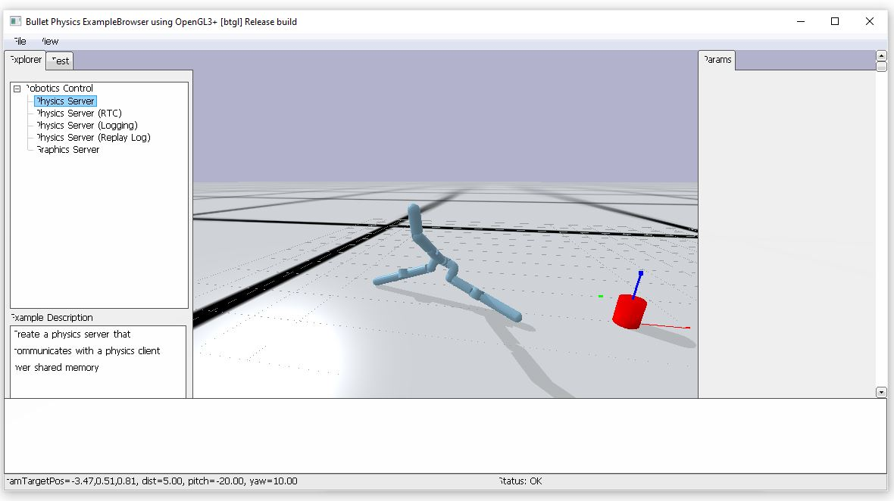

## AI-Toolbox - Motion Simulation - Expressive Aliens



Figure 1. Screenshot of the Expressive Aliens tool. The window depicts a non-humanoid articulated morphology (rendered as blue body) that moves across a horizontal plane towards a target position that is rendered as red cylinder. 

### Summary

Expressive Aliens is a Python-based tool that combines a physics simulation with reinforcement learning in order to train articulated bodies on locomotion movements that exhibit specific polarities of [Laban Efforts](https://en.wikipedia.org/wiki/Laban_movement_analysis). More specifically, the tool combines the rigid body dynamics simulation of the [Bullet physics](https://github.com/bulletphysics/bullet3) engine with reinforcement learning based on the [Soft-Actor-Critique](https://spinningup.openai.com/en/latest/algorithms/sac.html) (SAC) method. The Laban Efforts forms part of the rewards that an articulated body receives while learning to locomote towards a target position. Two types of the tool are provided here and each type exists in several versions. The first type of the tool trains the articulated bodies on a fixed combination of Laban Efforts. The second type of the tool trains the articulated bodies on variable combinations of Laban Efforts. Within each type, one version of the tool is used purely for training the articulated bodies, one for testing the trained articulated bodies, and one for interactively controlled a trained articulated bodies. While running the interactive version, the tool can be controlled by sending it OSC messages. This version of the tool also emits OSC messages that contain the synthetically generated motion data.  

### Installation

The software runs within the *premiere* anaconda environment. For this reason, this environment has to be setup beforehand.  Instructions how to setup the *premiere* environment are available as part of the [installation documentation ](https://github.com/bisnad/AIToolbox/tree/main/Installers) in the [AI Toolbox github repository](https://github.com/bisnad/AIToolbox). 

The software can be downloaded by cloning the [MotionSimulation Github repository](https://github.com/bisnad/MotionSimulation). After cloning, the software is located in the MotionSimulation / ExpressiveAliens directory.

### Directory Structure

- ExpressiveAliens
  - 3d_models (contains various morphologies for non-humanoid bodies stored in URDF format)
  - analysis (contains a python script to analyse motion data obtained from the articulated bodies )
  - common (contains python for plotting training and motion data and the implementation of a RingBuffer class)
  - controls (contains two example Max/MSP patches for interactively controlling the tool)
  - custom
    - agents (contains a python script that defines the agent class)
    - envs (contains a python script that defines an environment for the agent to move within)
    - rewards (contains python scripts for all the reward functions)
    - states (contains a python script that defines a state class)
      - agent_states (contains python scripts for all agent specific states)
      - alive_states (contains python scripts for states that determine weather an agent is considered alive or not)
  - data 
    - media (contains media used in this Readme)
  - learning (contains python scripts that implement the SAC reinforcement learning method)
  - results (contains the results of training runs as model weights, replay buffers, gif animations, and movement descriptors)
  - simulation (contains python scripts that specify classes for different objects existing in the simulation such as agents, bodies, body parts, body joints etc. also includes a python script for loading URDF files)
  - textures (contains the image used to texture the simulation ground plane)

### Usage

A description of the simulation environment, the agent morphologies, the reinforcement learning algorithm, and the reward functions that are used by the Expressive Aliens tool is beyond the scope of this Readme. This information is available in the paper entitled "Expressive Aliens - Laban Effort Factors
for Non-anthropomorphic Morphologies" which is available [here](https://www.researchgate.net/publication/359969230_Expressive_Aliens_-_Laban_Effort_Factors_for_Non-anthropomorphic_Morphologies). 

#### Start

There exist two types of the tool and each type exists in several versions. The first type of the tool trains the articulated bodies on a fixed combination of Laban Efforts. The second type of the tool trains the articulated bodies on variable combinations of Laban Efforts. Within each type, one version of the tool is used purely for training the articulated bodies, one for testing the trained articulated bodies, and one for interactively controlled a trained articulated bodies. Each category and version of a tool is available as a python script file, a Windows bat script, and a MacOS shell script. The scripts start the corresponding python script automatically. 

The names of the python scripts represent the following:

- sac_constant_inter.py : a tool for running the simulation with an articulated body that has been trained on a constant combination of Laban Effort reward functions in interactive mode
- sac_constant_test : a tool for running the simulation with an articulated body that has been trained on a constant combination of Laban Effort reward functions in test mode
- sac_constant_train : a tool for train a simulated articulated body on a constant combination of Laban Effort reward functions
- sac_control_inter : a tool for running the simulation with an articulated body that has been trained on a variable combination of Laban Effort reward functions in interactive mode
- sac_control_test : a tool for running the simulation with an articulated body that has been trained on a variable combination of Laban Effort reward functions in test mode
- sac_control_train : a tool for train a simulated articulated body on a variable combination of Laban Effort reward functions

Each of these tools can be started either by double clicking the corresponding bat (Windows) or shell (MacOS) script file or by typing the following commands into the Anaconda terminal:

```
conda activate premiere
cd MotionSimulation/ExpressiveAliens
python file_name.py
```

**Configuration File Import**

When the tool starts, it loads a configuration file that specifies several simulation and training parameters. These configuration files are located in the results folder. By default, the configuration file located in the folder `results/biped_target_dist1.0_move_dist1.0_run9` is loaded. To load a different configuration file, the following source code has to be changed in the main python script:

```
result_file_path = "results/biped_target_dist1.0_move_dist1.0_run9"
```

The string value assigned to the variable `result_file_path` specifies the path to the results folder that contains the configuration file. 

The configuration file is stored in JSON format. The settings in this file are grouped into the following setting groups: data, agent, target, reward, model. training, testing, visualization, save.

**Data Settings**

This setting group specifies the path where the training results are saved. Typically, this path is identical with the path where the configuration file is located. The individual settings are:

- Path where the training results are saved :  `result_file_path: <string path>`

**Agent Settings**

This setting group specifies several properties of the agent body. The individual settings are:

- The file path to the agent's body description saved in URDF format : `agent_model_file_path : <string file_path>`
- The power of the agent's actuated joints : `agent_power : <float power>` 
- The position where the agent is initially placed at the beginning of a training episode : `agent_reset_position :  [ <float posX> <float posY> <float posZ> ]`
- The orientation at which the agent is initially placed at the beginning of a training episode : `agent_reset_orientation :  [ <float rot> <float rotY> <float rotZ> <float rotW> ]`
- The names of the body parts that define the feet of an agent : `agent_feet_names : [ <string part1_name> ... <string partN_name>]`
- A flag whether collisions among the agent's own body parts are permitted : `agent_allow_self_collisions <bool collisions_permitted>`

**Target Settings**

This setting group specifies where the target is located towards which the agent should learn to locomote to. The individual settings are:

- The minimum distance from the center of the simulation space at which the target is randomly placed : `target_min_center_dist : <float min_dist>`
- The maximum distance from the center of the simulation space at which the target is randomly placed `target_max_center_dist : <float max_dist>`
- A flag wheather the target will be placed at a new random position whenever the agents gets close to it : `target_reset_when_agent_close : <bool reset_active>`
- The maximum distance between agent and target below which the target will be randomly placed at a new location if the target_reset_when_agent_close  flag is set to true : `target_reset_agent_max_distance : <float max_dist>`

**Reward Settings**

This setting group specifies the reward values received by the agent and the influence of these rewards on the overall reward. The individual settings are:

- Positive reward received by the agent for staying alive for one step during an episode : `agent_alive_cost : <float cost_value>`
- Negative reward received by the agent for dying  : `agent_not_alive_cost : <float cost_value>`
- Scaling factor for the Alive reward value : `agent_alive_reward_scale : <float scale_value>`
- Range of joint rotations the agent should learn not to exceed : `agent_joint_comfort_rotation_range : <float value_range>`
- Range of joint forces the agent should learn not to exceed : `agent_joint_comfort_force_range : <float value_range>`
- The maximum force exerted by a joint : `agent_joint_max_force : <float force_value>`
- Cost of applying torque to a joint : `agent_joint_torque_cost : <float cost_value>`
- Cost for joint rotation close to limit  : `agent_joint_limit_cost : <float cost_value>`
- Cost for joint rotation outside of preferred range : `agent_joint_rotation_cost : <float cost_value>`
- Cost for forces applied to joints along their fixed degrees of freedom : `agent_joint_force_cost : <float cost_value>`
- Scaling factor for all joint costs combined : `agent_joint_reward_scale : <float scale_value>`
- Cost for feet body parts to collide with rest of the agent's body : `agent_feet_collision_cost : <float cost_value>`
- Scaling factor for the feet collision cost: `agent_feet_collision_reward_scale : <float scale_value>`
- Cost for non-feet body parts to contact the ground plane : `agent_ground_contact_cost : <float cost_value>`
- Cost for the agent's body to not be aligned with its movement direction : `agent_body_misalignment_cost : <float cost_value>`
- Scaling factor for the body misalignment cost : `agent_body_misalignment_reward_scale : <float reward_scale>`
- Scaling factor for the agent's reward for changing its position : `agent_move_distance_reward_scale : <float reward_scale>`
- Scaling factor for the agent's reward for reducing the distance to the target position : `agent_target_distance_reward_scale : <float reward_scale>`
- Target value of the polarity of Laban Weight Effort the agent should exhibit : `agent_weight_effort_target_value : <float target_value>`
- Scaling factor for the reward received for Laban Weight Effort : `agent_weight_effort_reward_scale : <float reward_scale>`
- Maximum value of Laban Weight Effort : `agent_weight_effort_max_value : <float max_value>`
- Target value of the polarity of Laban Time Effort the agent should exhibit : `agent_time_effort_target_value : <float target_value>`
- Scaling factor for the reward received for Laban Time Effort : `agent_time_effort_reward_scale : <float reward_scale>`
- Maximum value of Laban Time Effort : `agent_time_effort_max_value : <float max_value>`
- Target value of the polarity of Laban Space Effort the agent should exhibit  : `agent_space_effort_target_value : <float target_value>`
- Scaling factor for the reward received for Laban Space Effort : `agent_space_effort_reward_scale : <float reward_scale>`
- Maximum value of Laban Space Effort : `agent_space_effort_max_value : <float max_value>`
- Target value of the polarity of Laban Flow Effort the agent should exhibit  : `agent_flow_effort_target_value : <float target_value>`
- Scaling factor for the reward received for Laban Flow Effort : `agent_flow_effort_reward_scale : <float reward_scale>`
- Maximum value of Laban Flow Effort  : `agent_flow_effort_max_value : <float max_value>`

**Model Settings**

This setting group specifies some of the settings for the model used in SAC-based reinforcement learning.  The individual settings are:

- Learning rate for the actor part in SAC : `sac_pi_learning_rate : <float learning_rate>`
- Learning rate for the critique part in SAC : `sac_q_learning_rate : <float learning_rate>`
- Size of the experience replay buffer : `sac_replay_size : <int buffer_size>`
- Size of the hidden layers used in the SAC neural network model: `sac_hidden_sizes : [<int layer1_unit_count> ... <int layerN_unit_count> ]`

**Training Settings**

This setting group specifies some of the settings for the training the agent.  The individual settings are:

- Number of epochs for training the agent : `epochs: <int epochs>`
- Number of episode steps per epoch : `steps_per_epoch: <int step_count>`
- Number of steps after which the next action is selected by the actor model instead of randomly chosen : `start_steps: <int step_count>`
- Number of steps after which training of the SAC model starts  : `update_after: <int step_count>`
- Number of steps after which training of model is repeated : `update_every: <int step_count>`
- Maximum number of steps per episode : `max_ep_len: <int step_count>`

**Testing Settings**

- This setting group specifies some settings for testing a trained agent. The individual settings are: 
- Epoch from a previous training that should be loaded when testing a previous training run : `test_epoch: <int epoch_count>`
- Number of episodes to use for testing a previous training run : `test_episode_count: <int episode_count>`

**Visualisation Settings**

This setting group specifies some settings for visualising the simulation. The individual settings are:

- Flag that specifies if the simulation is displayed as 3d graphics or not displayed at all : `render: <bool render_flag>`

**Save Settings**

This setting group specifies some settings for saving the agent's training results. The individual settings are:

- Epoch from a previous training that should be loaded : `load_epoch: <int epoch_count>`
- Flag that specifies if model weights from a previous training run should be loaded  : `load_model_weights: <bool load_flag>`
- Flag that specifies if the experience replay buffer from a previous training run should be loaded : `load_replay_buffer: <bool load_flag>`
- Interval in number of epochs at which model weights from the current training run are saved : `save_epoch_interval: <int epoch_count>`
- Flag that specifies if model weights from the current training run are saved : `save_model_weights: <bool save_flag>`
- Flag that specifies if the experience replay buffer from the current training run is saved : `save_replay_buffer: <bool save_flag>`

#### Functionality

**Training**

When running the training version of the tool, it trains the SAC model for a specific number of epochs. It does so by running the simulation over of specific number of simulation steps (which corresponds to the episode length). At the beginning of an episode, the agent is placed in a slightly randomised orientation and pose in the center of the simulation environment and the position target is placed at a randomised location. In case of the "control" version of the tool in which the rewards associated with the Effort Factors are varied over the course of training, the polarity of the Effort value and the scale of the Effort reward are also randomised at the beginning of an episode. In case of the constant version of the tool, the Effort value and Effort reward scale are kept constant.  The episode runs until the maximum number of episode steps is reached or until the agent dies (whatever comes first). An agent can die if the forces acting on it become too large. During training, the weights of the neural networks in the SAC model and the experience reward buffer are repeatedly saved and the training progress is monitored. 

**Testing**

When running the testing version of the tool, it loads a SAC model from a previous training run and then runs the simulation over a specified number of epochs. Each of the episodes is rendered as a GIF animation and the Effort values at each simulation step are logged and exported.

**Interaction**

When running the interactive version of the tool, it loads a SAC model from a previous training run and then runs the simulation indefinitely. The simulation is rendered as a simple 3D graphics (see figure 1). The tool sends motion data obtained from the agent as OSC messages. The tool can also be controlled by sending OSC messages to it. 

### Graphical User Interface

When the tool is running in training mode with the render flag set to true in the configuration file or when the tool is running in testing or interaction mode, the simulation is rendered as a simple 3D graphics (see figure 1). 

### OSC Communication

The interactive version of the tool sends motion data of the agent as OSC messages. The OSC messages represent the absolute positions, absolute rotations, and relative rotations of the joints in each articulated body.  Each message contains all the joints positions or rotations of one body grouped together. In the OSC messages described below, N represents the number of joints.

- joint positions as list of 3D vectors in absolute coordinates: `/agent/joint/pos <string body_name> <float j1_px> <float j1_py> <float j1_pz> ... <float jN_px> <float jN_py> <float jN_pz>` 
- joint rotations as list of quaternions in absolute coordinates: `/agent/joint/rot <string body_name> <float j1_px> <float j1_py> <float j1_pz> <float j1_pw> ... <float jN_px> <float jN_py> <float jN_pz> <float jN_pw>` 

By default, the interactive version of the tool sends its OSC messages to a destination with a local IP address and port  9003. To change the IP address and port, the following source code in the main python script has to be modified:

```
osc_send_address = "127.0.0.1"
osc_send_port = 9003
```

The string value passed to the variable `osc_send_address` specifies the IP address of the destination. The address "127.0.0.1" represents the local machine of which the tool itself is running. The integer value passed to the variable `osc_send_port` represents the port number of the destination. 

The interactive version of the tool can also be controlled through OSC messages. 

The following OSC message can be received by both interactive tools, the one that employs fixed Laban Effort rewards and the one that employs variable Laban Effort rewards.

- set the position of the target location on the ground plane :  `/target/position <float px> <float py>`

The following OSC messages can only received by the interactive tool that employs variable Laban Effort rewards.

- set the reward scale for the proximity of the agent to the target location :  `/distance/scale <float scale>`
- set the reward scale for the Weight Effort reward :  `/weight/scale <float scale>`
- set the reward scale for the Time Effort reward :  `/time/scale <float scale>`
- set the reward scale for the Space Effort reward :  `/space/scale <float scale>`
- set the reward scale for the Flow Effort reward :  `/flow/scale <float scale>`
- set the target polarity of the Weight Effort:  `/weight/target<float target>`
- set the target polarity of the Time Effort:  `/time/target<float target>`
- set the target polarity of the Space Effort:  `/space/target<float target>`
- set the target polarity of the Flow Effort:  `/flow/target<float target>`

By default, the interactive version of the tool receives OSC messages on port  9005. To change the IP address and port, the following source code in the main Python script has to be modified:

```
osc_rec_address = "0.0.0.0"
osc_rec_port = 9005
```

The string value passed to the variable `osc_rec_address` specifies the IP address of the tool receives the OSC messages from. The address "0.0.0.0" represents any address. The integer value passed to the variable `osc_rec_port` represents the port number on which the tool receives the OSC messages. 

### Limitations and Bugs

None known.


