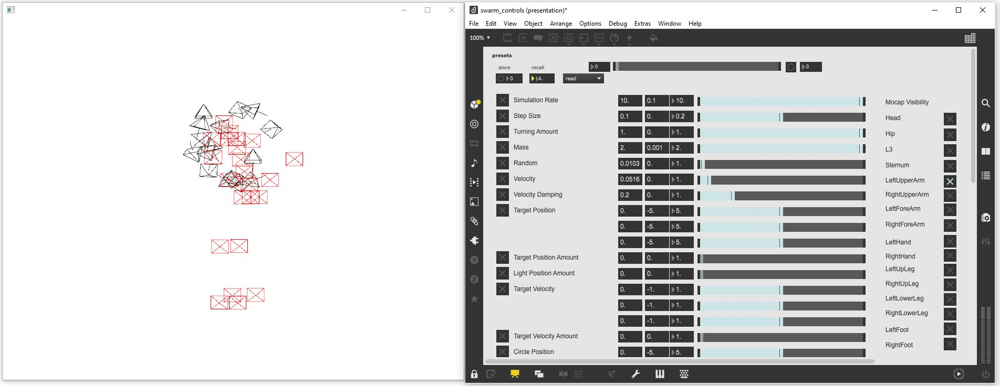

# AI-Toolbox - Motion Simulation - Swarms



Figure 1: Screenshot of the Swarms tool. The window on the left shows the visual output of the Swarms tool which consists of drawing the flocking agents as pyramids and displaying the motion recent agent trajectories as line segments. The agents in the flock directly controlled by the dancer are shown in red color. The agents in the flock that moves with more autonomy as shown in black color. The window on the right shows an example Max patch that illustrate how to control the Swarms tool by sending it OSC messages.

### Summary

This tool is a C++-based software that employs a flocking simulation to the model the behaviour of agents that exhibit coordinated movements in space. The simulation makes use of the ofxDabFlock addon for [openFrameworks](https://openframeworks.cc/). This addon is very flexible with regards to the number of flocks and number, properties, and behaviours of the agents in each flock. This flexibility turned out to be very helpful for adapting the simulation for interactive applications in dance. In the example implementation included in the AI-Toolbox, the simulation employs two flocks. One flock is directly controlled by a motion data captured from dancer with the agents possessing the same spatial positions as the joints of the dancer. The second flock possesses a higher level of autonomy that it exhibits through various behaviors that control its movements with respect to agents in the first flock and agents in the second flock. While running, the tool sends motion data in the form of global positions and velocities of the agents via [OSC](https://en.wikipedia.org/wiki/Open_Sound_Control) to a destination address. The tool can also be remote controlled via [OSC](https://en.wikipedia.org/wiki/Open_Sound_Control).

### Installation

To simply run the tool, no installation is required. The software runs on any MacOS or Windows 10 or 11 operating system. If the user wants to compile the software from source, both a C++ IDE such as [XCode](https://developer.apple.com/xcode/) on MacOS or [Visual Studio](https://visualstudio.microsoft.com/vs/community/) on Windows and the [openFrameworks](https://openframeworks.cc/) creative coding environment need to be installed beforehand. Installation instructions for Visual Studio and openFrameworks are available in the [AI Toolbox github repository](https://github.com/bisnad/AIToolbox). 

The software can be downloaded by cloning the [MotionSimulation Github repository](https://github.com/bisnad/MotionSimulation). After cloning, the software is located in the MotionSimulation / Swarms directory.

### Directory Structure

Swarms(contains tool specific python scripts)

- bin (contains the software  executable and dynamic libraries)
  - data
    - shaders (contains GLSL shader code to render the flocking agents)
- controls (contains two example Max patches for controls the tool by sending OSC messages)
- data 
  - media (contains media used in this Readme)
- max (contains an example Max patch for forwarding OSC messages received by the Swarms tool to multiple IP addresses and ports)
- src (contains the source code files)

### Usage

#### Start

The tool can be started by double clicking the executable Swarms file. 

#### Functionality

This tool runs a flocking simulation that models  the behaviour of agents that exhibit coordinated movements in space. The agents are point-like entity that possess physical properties and behaviours and that can perceive each other. Agents are organised in flocks with all agents within a group sharing the same properties. Multiple flocks can coexist in the simulation. In the example provided here, there are two flocks.  One flock is directly controlled by motion data captured from a dancer with the agents possessing the same spatial positions as the joints of the dancer. The second flock possesses  various behaviors that control its movements with respect to agents in the first flock and also with respect to agents in the second flock. By changing the operation and influence of these behaviours on the overall movement of the agents in the second flock, the degree of autonomy and diversity of the second flock with regards to the movements of the dancer can be varied. While running, the simulation sends the motion data of the agents in the second flocks via OSC to a destination address. This data can then be further process to for example control the motion of robotics lights as was done for the dance pieces "[Re-Embodied Machine](https://www.stocos.com/en/page/embodied-machine-2/)" and "[Incubatio](https://www.stocos.com/en/page/embodied-machine-3/)".

**Flock 1**

In the example provided, the first flock consists of 23 agents. This number of agents matches the number of joints that were captured from the dancer using the [XSens Awinda](https://www.movella.com/products/wearables/xsens-mtw-awinda) motion capture system. The agents in this flock possess as physical properties "position" and "velocity" and lack any behaviours.

**Flock 2**

In the example provided, the second flock consists of 16 agents. This number of agents matches the number of robotics lights that were used in the dance pieces "Re-Embodied Machine" and "Incubatio". Agents in this flock possess as physical properties "mass", "position", "velocity", "acceleration", and "force". These agents possess the following behaviours:

- randomize : to generate forces that randomly perturb the motion of the agents.
- damping : to cause the agents to move with a specific speed
- targetPos : to cause the agents to move towards a given position in space
- lightPos : to cause the agents to move to second position in space that typically corresponds to the position of a robotic light on stage
- targetVel : to cause the agents to move with a specific velocity (this effect is directional, contrary to the damping behaviour)
- circular : to cause the agents to exhibit a circular motion
- cohesion : to cause agents in the second flock to be attracted to each other
- alignment : to cause agents in the second flock to align their movement direction
- evasion : to cause agents in the second flock to avoid collisions with each other
- mocap_cohesion : to cause agents in the second flock to be attracted to agents in the first flock
- mocap_alignment : to cause agents in the second flock to align their movement direction with those in the first flock
- mocap_evasion :  to cause agents in the second flock to avoid collisions with agents in the first flock
- boundaryWrap : to cause agents to wrap around their positions when they leave a rectangular region
- boundaryMirror : to cause agents to be reflected in the movement direction when they collide with the boundary faces of a rectangular region
- acceleration : to cause the agents to convert the forces acting on them into accelerations
- integration : to compute the velocities and positions of agents from their accelerations.

### Graphical User Interface

The tool renders the agents in the two flocks a pyramids whose position and orientation matches those of the agents. It also renders the most recent motion trajectory of the agents a line segments. Agents in the first flock are drawn in red color and those in the second flock are drawn in black color (see figure 1).

### OSC Communication

The tool sends the following OSC messages representing the absolute positions and velocities of the agents in the second flock.  Each message contains all the agent positions and velocities grouped together. In the OSC messages described below, N represents the number of agents.

The following OSC messages are sent by the tool:

- agent positions as list of 3D vectors in absolute coordinates: `/swarm/0/15/position <float a1x> <float a1y> <float a1z> .... <float aNx> <float aNy> <float aNz>` 
- agent velocities as list of 3D vectors in absolute coordinates `/swarm/0/15/velocity <float a1x> <float a1y> <float a1z> .... <float aNx> <float aNy> <float aNz>` 

By default, the tool sends its OSC messages to a destination with a local IP address and port  9005. To change the IP address and port, the following source code in the file ofApp.cpp has to be modified:

```
simulation.com().createSender("FlockSender", "127.0.0.1", 9005, false);
```

The string value passed as first parameter to the `createSender` function specifies the name of the OSC sender instance. This name should not be changed since it is referred to elsewhere in the code. The string value passed as second parameter to the function specifies the IP address of the destination. The address "127.0.0.1" represents the local machine of which the tool itself is running. The integer value passed as third parameter to the function represents the port number of the destination. The bool value passed as fourth parameter to the function specifies if an extended version of the OSC protocol should be used that allows to pack more data into the OSC messages. Typically this value should be set to false.

The Swarms tool can be thoroughly configured and modified through OSC messages. For this purpose, the tool supports a very large number of different OSC messages. All available OSC commands are described [here](http://swarms.cc/documentation/networking/osc_commands.php). The OSC commands that apply to the example provided below. If not mentioned otherwise, these commands affect the agents in flock 2 only. 

- set the update rate of the swarm simulation in miliseconds :`/SetSimulationRate <float rate>` 
- set the time increment for computing positions and velocities of agents: `/SetParameter swarm integration_timestep <float stepsize>`
- set the maximum possible angular acceleration of agents in  x, y, z coordinates: `/SetParameter swarm acceleration_maxAngularAcceleration <float ax> <float ay> <float az>`
- turn boundary mirror mode on (active > 0.0) or off (active <= 0.0) :  `/SetParameter swarm boundaryMirror_active <float active>`
- specify the lower corner of the mirror boundary cube in x, y, z coordinates : `/SetParameter swarm boundaryMirror_lowerBoundary <float cx> <float xy> <float cz>`
- specify the upper corner of the mirror boundary cube in x, y, z coordinates : `/SetParameter swarm boundaryMirror_upperBoundary <float cx> <float xy> <float cz>`
- turn boundary wrap mode on (active > 0.0) or off (active <= 0.0) : `/SetParameter swarm boundaryWrap_active <float active>`
- specify the lower corner of the wrap boundary cube in x, y, z coordinates : `/SetParameter swarm boundaryWrap_lowerBoundary <float cx> <float xy> <float cz>`
- specify the upper corner of the wrap boundary cube in x, y, z coordinates : `/SetParameter swarm boundaryWrap_upperBoundary <float cx> <float xy> <float cz>`
- set the mass of agents : `/SetParameter swarm mass <float mass>`
- set the size of the randomised forces that perturb agents in x, y, z coordinates : `/SetParameter swarm randomize_range <float rx> <float ry> <float rz>`
- set the preferred speed at which agents move : `/SetParameter swarm damping_prefVelocity <float speed>`
- set the amount of the effect that causes agents to move at a preferred speed : `/SetParameter swarm damping_amount <float amount>`
- set the position of a target position to which agents are attracted to in x, y, z coordinates : `/SetParameter swarm targetPos_target <float px> <float py> <float pz>`
- set the amount of attraction of the agent to the target position : `/SetParameter swarm targetPos_amount <float amount>`
- set the amount of attraction of the agents to the position of a robotic light : `/SetParameter swarm lightPos_amount <float amount>`
- set the direction of a target velocity into which the agents move in x, y, z coordinates : `/SetParameter swarm targetVel_target <float vx> <float vy> <float vz>`
- set the amount with which the agents move in the direction of the target velocity : `/SetParameter swarm targetVel_amount <float amount>`
- set the center position of a sphere around which agents orbit in x, y, z coordinates : `/SetParameter swarm circular_centerPosition <float px> <float py> <float pz>`
- set the inner radius of the sphere below which agents are pushed towards the sphere surface : `/SetParameter swarm circular_innerRadius <float radius>`
- set the outer radius of the sphere above which agents are pushed towards the sphere surface : `/SetParameter swarm circular_outerRadius <float radius>`
- set the amount of ortogonal attraction of the agents towards the sphere surface : `/SetParameter swarm circular_ortAmount <float amount>`
- set the amount of tangential attraction of the agents along the sphere surface : `/SetParameter swarm circular_tanAmount <float amount>`
- set the maximum distance below which agents avoid collisions among themselves : `/SetParameter swarm evasion_maxDist <float dist>`
- set the amount with which agents avoid collisions among themselves : `/SetParameter swarm evasion_amount <float amount>`
- set the maximum distance below which agents are attracted towards each other : `/SetParameter swarm cohesion_maxDist <float dist>`
- set the amount with which agents are attracted towards each other : `/SetParameter swarm cohesion_amount <float amount>`
- set the maximum distance below which agents move in the same direction : `/SetParameter swarm alignment_maxDist <float dist>`
- set the amount with which agents move in the same direction : `/SetParameter swarm alignment_amount <float amount>`
- set the maximum distance with which agents in the second flock avoid collisions with agents in the first flock : `/SetParameter swarm mocap_evasion_maxDist <float dist>`
- set the amount with which agents in the second flock avoid collisions with agents in the first flock : `/SetParameter swarm mocap_evasion_amount <float amount>`
- set the maximum distance below which agents in the second flock are attracted towards agents in the first flock : `/SetParameter swarm mocap_cohesion_maxDist <float dist>`
- set the amount with which agents in the second flock are attracted to agents in the first flock : /`SetParameter swarm mocap_cohesion_amount <float amount>`
- set the maximum distance below which agents in the second flock move in the same direction as agents in the first flock : `/SetParameter swarm mocap_alignment_maxDist <float dist>`
- set the amount with which agents in the second flock move in the same direction as agents in the first flock : `/SetParameter swarm mocap_alignment_amount <float amount>`
- set the visibility of the agent in the first flock that represents the dancer's right hand to agents in the second flock. A value above 0.0 corresponds to visible. A value of below 0.0 corresponds to invisible.  `/AssignNeighbors mocap_swarm 10 position mocap_position <float visibility>` 
- set the visibility of the agent in the first flock that represents the dancer's left hand (XSens Mocap Joint) to agents in the second flock :  `/AssignNeighbors mocap_swarm 14 position mocap_position <float visibility>` 
- set the visibility of the agent in the first flock that represents the dancer's right foot  (XSens Mocap Joint) to agents in the second flock : `/AssignNeighbors mocap_swarm 17 position mocap_position <float visibility>`
- set the visibility of the agent in the first flock that represents the dancer's left foot  (XSens Mocap Joint) to agents in the second flock : `/AssignNeighbors mocap_swarm 21 position mocap_position <float visibility>`
- set the visibility of the agent in the first flock that represents the dancer's pelvis  (XSens Mocap Joint) to agents in the second flock : `/AssignNeighbors mocap_swarm 0 position mocap_position <float visibility>`
- set the visibility of the agent in the first flock that represents the dancer's l3 joint  (XSens Mocap Joint) to agents in the second flock : `/AssignNeighbors mocap_swarm 2 position mocap_position <float visibility>`
- set the visibility of the agent in the first flock that represents the dancer's sternum  (XSens Mocap Joint) to agents in the second flock : `/AssignNeighbors mocap_swarm 4 position mocap_position <float visibility>`
- set the visibility of the agent in the first flock that represents the dancer's head  (XSens Mocap Joint) to agents in the second flock : `/AssignNeighbors mocap_swarm 6 position mocap_position <float visibility>`
- set the visibility of the agent in the first flock that represents the dancer's left forearm  (XSens Mocap Joint) to agents in the second flock : `/AssignNeighbors mocap_swarm 13 position mocap_position <float visibility>`
- set the visibility of the agent in the first flock that represents the dancer's right forearm  (XSens Mocap Joint)  to agents in the second flock : `/AssignNeighbors mocap_swarm 9 position mocap_position <float visibility>`
- set the visibility of the agent in the first flock that represents the dancer's left upper arm  (XSens Mocap Joint) to agents in the second flock : `/AssignNeighbors mocap_swarm 12 position mocap_position <float visibility>`
- set the visibility of the agent in the first flock that represents the dancer's right upper arm  (XSens Mocap Joint) to agents in the second flock : `/AssignNeighbors mocap_swarm 8 position mocap_position <float visibility>`
- set the visibility of the agent in the first flock that represents the dancer's left lower arm  (XSens Mocap Joint) to agents in the second flock : `/AssignNeighbors mocap_swarm 20 position mocap_position <float visibility>`
- set the visibility of the agent in the first flock that represents the dancer's right lower arm  (XSens Mocap Joint) to agents in the second flock : `/AssignNeighbors mocap_swarm 16 position mocap_position <float visibility>`
- set the visibility of the agent in the first flock that represents the dancer's left upper leg  (XSens Mocap Joint) to agents in the second flock : `/AssignNeighbors mocap_swarm 19 position mocap_position <float visibility>`
- set the visibility of the agent in the first flock that represents the dancer's left lower leg  (XSens Mocap Joint) to agents in the second flock : `/AssignNeighbors mocap_swarm 15 position mocap_position <float visibility>`

### Limitations and Bugs

None known
